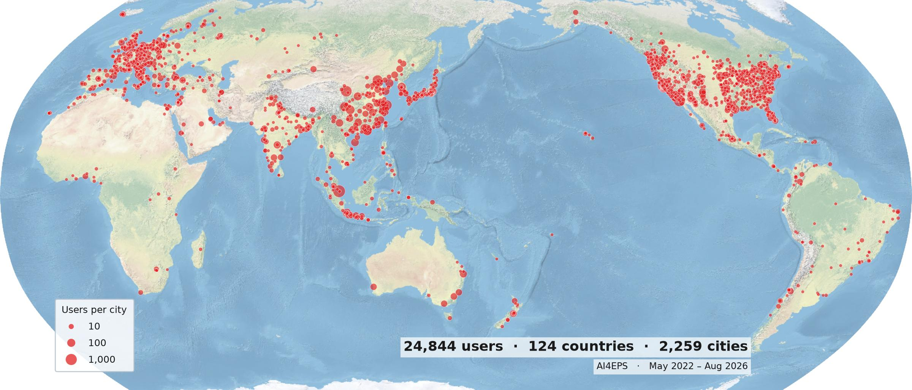

## Welcome to AI4EPS: Artificial Intelligence (AI) for Earth and Planetary Science (EPS) at UC Berkeley

<!-- AI; artificial intelligence; machine learning; deep learning; neural network;
     foundation model; earthquake; earthquake detection; earthquake monitoring;
     earthquake catalog; phase picking; phase association; earthquake location;
     seismology; seismic; seismic imaging; tomography; waveform; DAS; distributed
     acoustic sensing; ground motion; Earth science; Earth; planetary science;
     geophysics; geoscience; UC Berkeley; Berkeley; EPS -->
